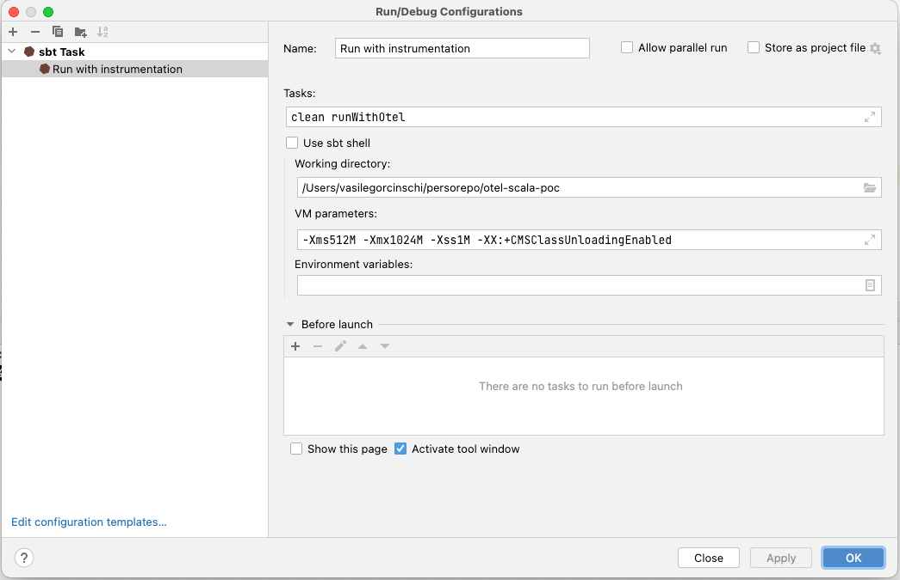

# otel-auto-scala-poc

A proof of concept project that proves the assumption that Opentelemetry metrics
can be sent to an otel collector without any of the following:
- having SDK dependencies on the classpath
- having `exporter-otlp` or `exporter-otlp-metrics` dependencies
- manually instrumenting `MeterProvider`, `Meter` etc.

## Runbook

### Assumptions & prerequisites

- This code is not designed to be remotely deployed and run on a server. Therefore Scala's `sbt`
(simple build tool) is to be used for running the code.
- You will need to download Opentelemetry javaagent version 1.12.0 from [here](https://github.com/open-telemetry/opentelemetry-java-instrumentation/releases/tag/v1.12.0) 
  - In the run configuration we renamed the jar to `opentelemetry-javaagent-all-v1.12.0.jar`
  adjust your configuration if you choose a different convention.
  - Place it into the [resources](src/main/resources) directory.
- We use IntelliJ's sbt runner. Please reproduce the configuration locally
or adjust your run environment accordingly:

  
### Run

Run the sbt task using IntelliJ (the green trianle button).
  
